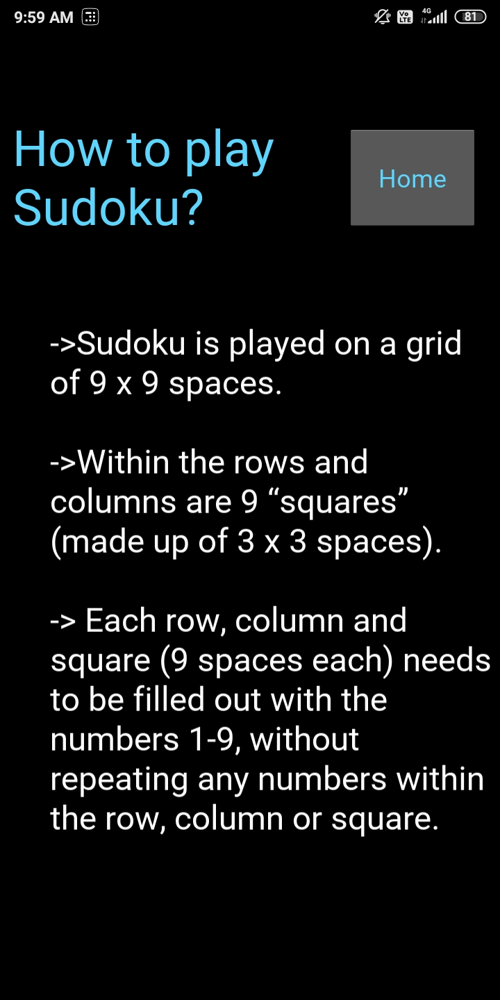
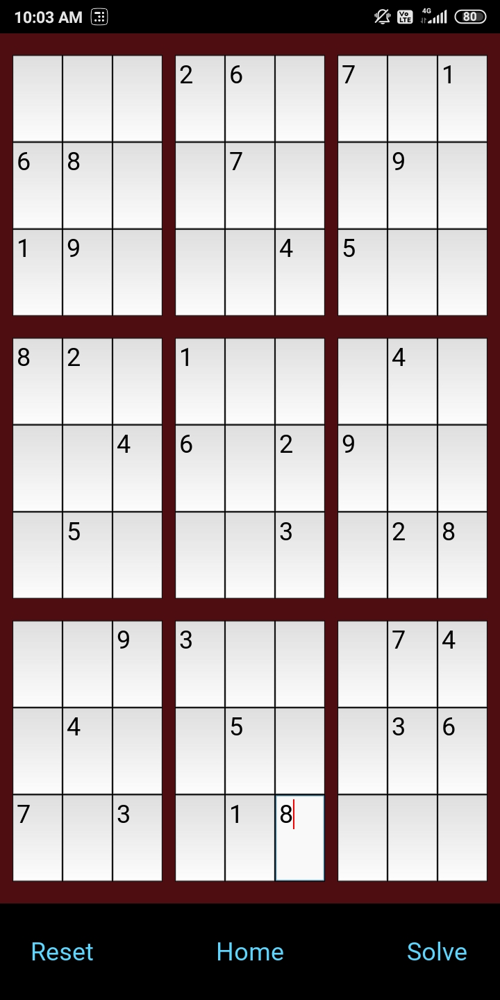
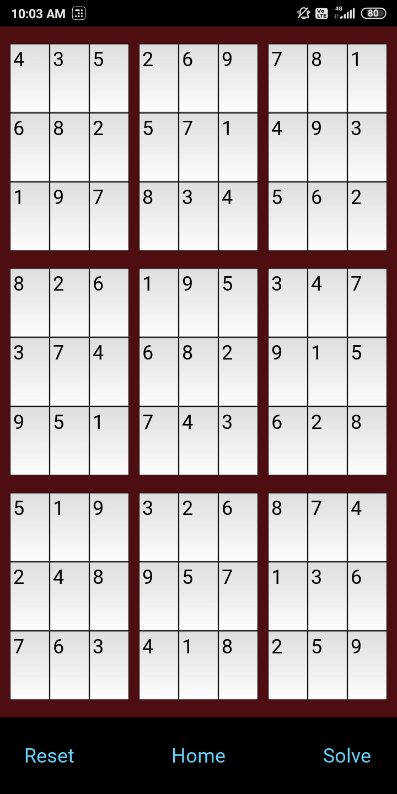

# Sudoku-Solver---Kivy-Python-Android-Application
 
<h2> Table of Content </h2>

<ul>
  <li><a href='#overview'>Overview</a></li>
  <li><a href='#motivation'>Motivation</a></li>
  <li><a href='#analysis'>Analysis Highlights</a></li>
  <li><a href='#credits'>Credits</a></li>
  
</ul> 
 

<h2 id = 'overview'> Overview </h2>

This project is an attempt to build an android application that helps the user to solve a sudoku puzzle. This application is build using the <a href= 'https://www.google.com/url?sa=t&rct=j&q=&esrc=s&source=web&cd=&cad=rja&uact=8&ved=2ahUKEwjyrKvyo5DtAhU1juYKHQrQBZkQFjAAegQIARAD&url=https%3A%2F%2Fkivy.org%2F&usg=AOvVaw2sQzH6hugoCP4InvINovCg'>Kivy</a> framework of python. It is a project that helped me actualize the OOP concepts, Back Tracking Algorithm and Kivy.
Finally I have built the APK using <a href= 'https://buildozer.readthedocs.io/en/latest'/>Buildozer</a>. Following are a few snapshots that were taken from an android phone. 
<h3>1) Application Image &nbsp &nbsp &nbsp &nbsp &nbsp &nbsp &nbsp &nbsp 2) Home Page &nbsp &nbsp &nbsp &nbsp &nbsp &nbsp &nbsp &nbsp 3) How to play Sudoku?</h3>

    
 &nbsp &nbsp &nbsp &nbsp &nbsp &nbsp &nbsp  &nbsp 
  
   &nbsp &nbsp &nbsp &nbsp &nbsp &nbsp &nbsp  &nbsp 
  

  

<h3>4) Let's Start! :</h3>

    
 &nbsp &nbsp &nbsp &nbsp &nbsp &nbsp &nbsp  &nbsp 
  

 

 

<h2 id = 'motivation'> Motivation </h2>

  I still remember those dreaded summer afternoons in my childhood when my father made me solve Sudoku. However, after solving about a score of these "mind-numbing" puzzles, Sudoku grew on me. Unknowingly, I had built my own algorithm that was intuitive to a human mind.  
  When I had finished learning quite a bit about Python Programming, I was searching for Projects that would leverage all that I had learnt regarding OOP Concepts. I took on this project because of the apparent connection I had with Sudoku; even if it meant for me to learn a new framework - Kivy. I also learnt about the <a href= 'https://www.geeksforgeeks.org/backtracking-algorithms/'>Back Tracking Algorithm</a> and how it can save a lot of computational hassle.

 

<h2 id = 'credits'> Credits </h2>

<ul>  
  <li>Since this is my first project using Python's Kivy Framework, I relied on <a href= 'https://www.youtube.com/channel/UCMMitT9SCbWlEcEkemnsxQg'>Eric Sandberg's YouTube Channel</a> to learn the ropes!
  </li>
 
  
  
  <li>I would also like to mention <a href= 'https://www.geeksforgeeks.org/backtracking-algorithms/'>GeeksForGeeks</a> referring which I understood how Back Tracking Algorithm can be leveraged in various situations.
  </li>
  
  </ul>

 

